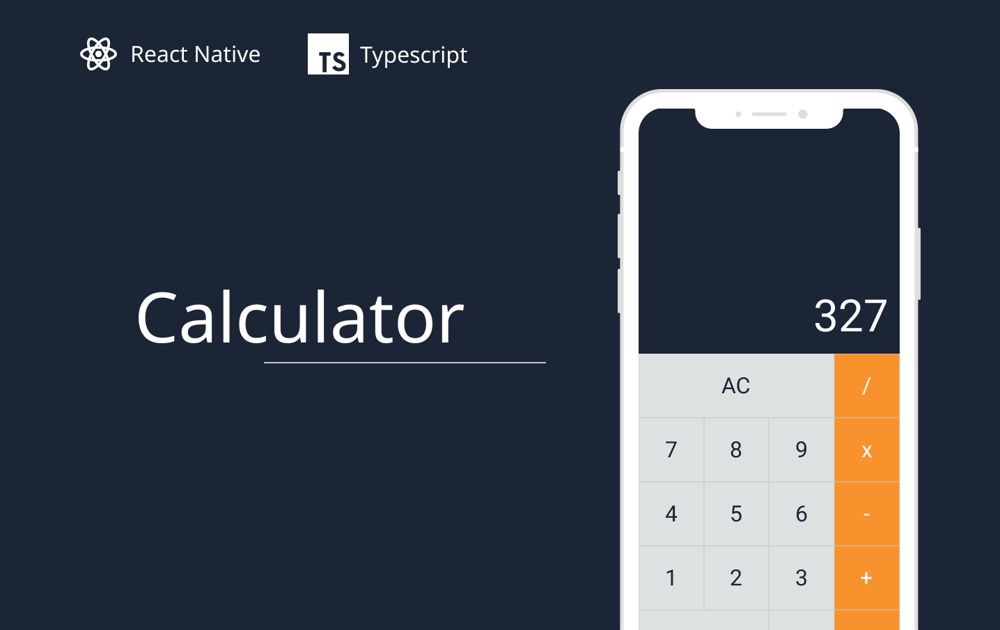

  

 

  

## ✨ Technologies

This project was developed with the following technologies:

- [React Native](https://reactnative.dev/)
- [Expo](https://expo.io/)
- [Typescript](https://www.typescriptlang.org/)
- [Styled Components](https://styled-components.com/)

## 💻 Project

"Calculator" is a simple calculator mobile app based on the macOS calculator.

## 🔖 Layout

You can view the project layout through [this link](https://www.figma.com/file/Dx9ijpSRwDe6u1JFgHEkmU/Calculator?node-id=0%3A1).

## 🚀 How to run on your system

- Clone the repository and open it;
- Install Node.js on your system;
- Install NPM on your system;
- Run the command `npm install` on your terminal;
- Run the command `npm start` on your terminal;
- Install the app [Expo Go](https://expo.io/client) on your IOS or Android smartphone;
- Follow the Expo Go app instructions to access this project.

## 📄 License

This project is under the MIT license. See the [LICENSE](LICENSE.md) file for more details.

---

Made by Daniel Carvalho <daniellc.prg@gmail.com>.
